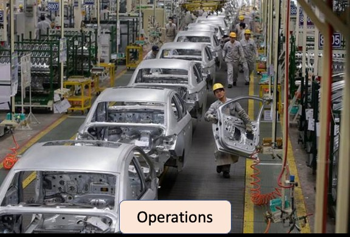
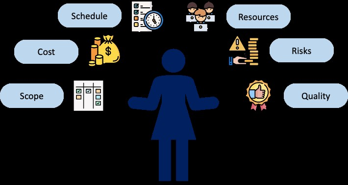
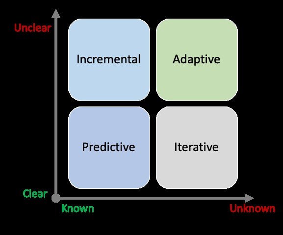

# Chapter 1: Introduction to Projects

## What is a Project?
Projects are temporary endeavours that are undertaken to achieve a specific goal or outcome. They are unique, non-routine activities designed to create a product, service, or result that is not part of an organization’s usual operations. Projects can range from small tasks to large initiatives that take years to complete.

### Examples of Projects
- **Product:** A customized vehicle that’s unique and different from regular vehicles.
- **Service:** A consulting project.
- **Result:** Improvement in sales/services.

### Project Examples
#### Construction of a New Building
A large and complex project involving multiple stakeholders such as architects, engineers, contractors, and construction workers. It requires coordination of various tasks including site preparation, foundation work, framing, electrical and plumbing work, and finishing.

#### Development of a New Software Application
A smaller yet complex project involving developers, designers, project managers, and quality assurance personnel. The team follows specific requirements to develop a functional application.

### Key Characteristics of Projects
- **Temporary Nature:** A project has a defined start and end date.
- **Closure Upon Completion:** Once objectives are achieved, the project team disbands.
- **Difference from Operations:** Operations are ongoing activities necessary for sustaining an organization.

## Operations vs. Projects

### What are Operations?
Operations refer to ongoing activities and processes necessary to keep an organization running smoothly.

Example: A hospital’s patient care, maintenance, and administration.

### Differences Between Projects and Operations

| Criterion   | Project | Operation |
|------------|---------|-----------|
| **Purpose** | To create a unique product, service, or result | To sustain an organization’s core business |
| **Timeframe** | Temporary with a start and end date | Ongoing and continuous |
| **Complexity** | Non-routine and complex activities | Routine and repetitive activities |
| **Scope** | Specific objectives and deliverables | Broader scope, not necessarily tied to specific objectives |
| **Resources** | Requires specific resource allocation | Uses an established infrastructure and ongoing budget |

---

# Chapter 2: Introduction to Project Management

Project management is the process of planning, organizing, and managing resources to complete a project successfully. It involves using specific tools, techniques, and methodologies to ensure projects meet scope, time, and budget constraints.

## Project Management Constraints
- **Scope:** Defines the work needed to achieve the project’s objectives.
- **Cost:** The budget allocated to the project.
- **Schedule:** The time available for project completion.
- **Resources:** The people, materials, and equipment required.
- **Risk:** Potential uncertainties that may impact the project.
- **Quality:** The standards the project must meet.

---

# Chapter 3: Project Management Approaches

## Different Approaches to Project Management

### **Predictive (Waterfall) Approach**
A linear, sequential process where each phase is completed before moving to the next. Commonly used in construction and manufacturing.

Example: Building a bridge.

### **Iterative Approach**
A repetitive process where deliverables are refined based on feedback and testing. Commonly used in software development.

Example: Developing a mobile application through repeated testing cycles.

### **Incremental Approach**
A project is broken into smaller, independent parts. Each increment builds upon the previous one.

Example: Building a website with basic functionality first, then adding features over time.

### **Adaptive (Agile) Approach**
Focuses on flexibility, collaboration, and rapid feedback, making adjustments throughout the project.

Example: Agile Scrum methodology, where teams work in sprints to deliver small functional pieces.

---

# Selecting a Project Management Approach

## Factors Influencing Selection
- **Type of project**
- **Complexity**
- **Uncertainty level**
- **Stakeholder requirements**
- **Project team’s experience and capabilities**

## Considerations
- **Objectives & Scope:** Identify project goals to determine the right approach.
- **Organizational Culture:** Agile suits flexible organizations, while Waterfall fits hierarchical structures.
- **Risk Level:** Higher risk projects may need predictive methods; lower risk projects allow flexibility.

### **Conclusion**
Choose an approach aligned with project objectives, stakeholders, organizational culture, resources, and risk level.

---

# Overview of Project Management Approaches

| Approach   | Requirements | Activities | Delivery | Goal |
|------------|-------------|------------|----------|------|
| **Predictive** | Fixed | Performed once | Single delivery | Manage cost |
| **Iterative** | Dynamic | Repeated until correct | Single delivery | Correctness of solution |
| **Incremental** | Dynamic | Performed once per increment | Frequent deliveries | Speed of delivery |
| **Adaptive** | Dynamic | Repeated until correct | Frequent deliveries | Customer value |

## Example Applications
- **Predictive:** Building a bridge, developing a manufacturing plant.
- **Iterative:** Software development, product design.
- **Incremental:** Website development, product development.
- **Adaptive:** Agile software development, digital marketing campaigns.
